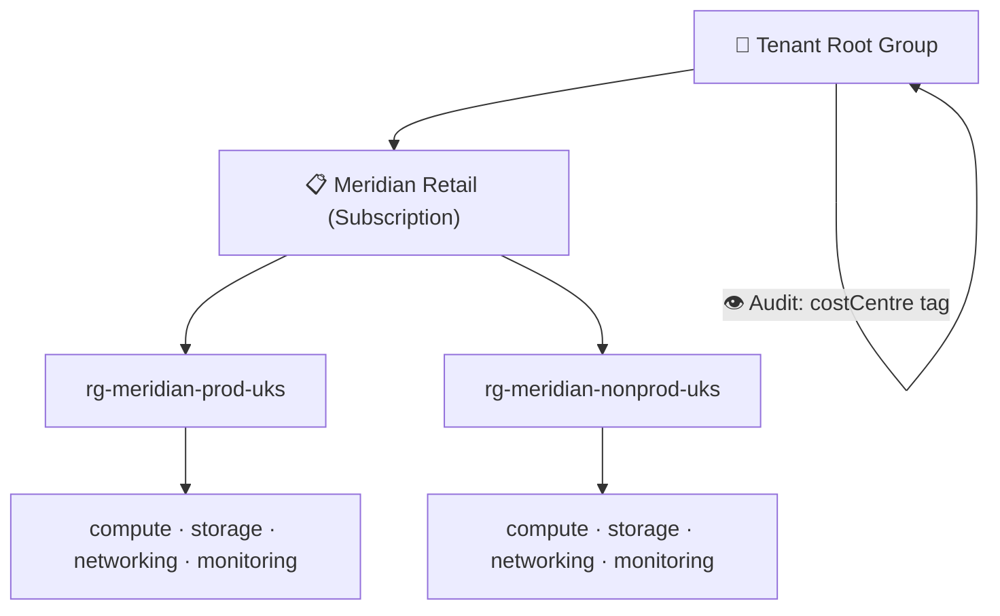
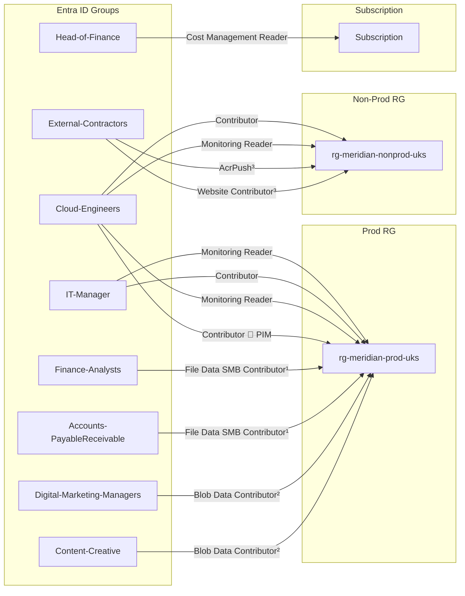
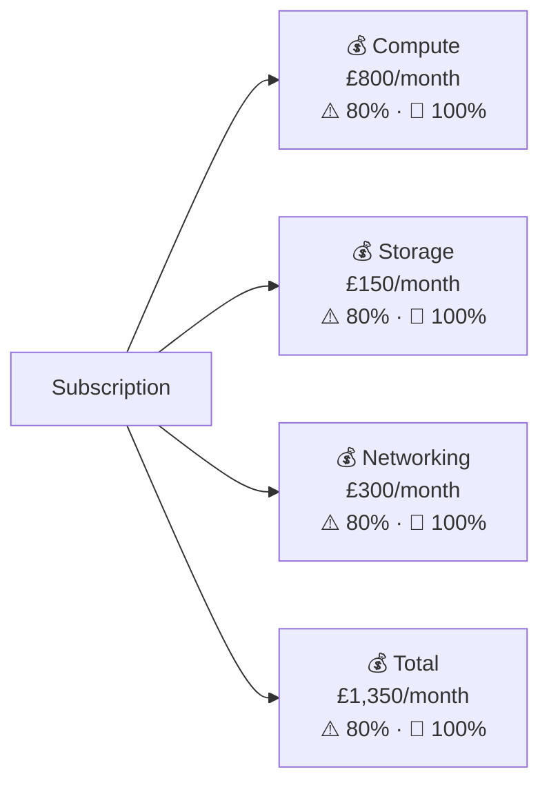

# Meridian Retail — Architecture

## Identity & Governance

### Management Group & Subscription Hierarchy

### Entra Groups & RBAC

> ¹ Scoped to Finance file share — deployed in storage module
> ² Scoped to product images container — deployed in storage module
> ³ Scoped to ACR and App Service resources — deployed in their respective modules

### Cost Budgets

---

*Sections will be added as each module is built.*
